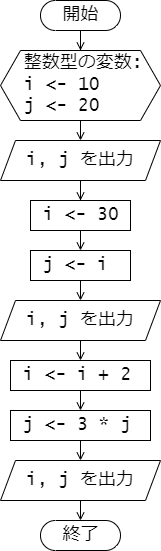
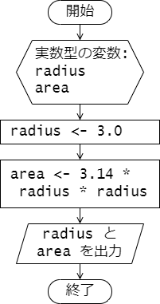
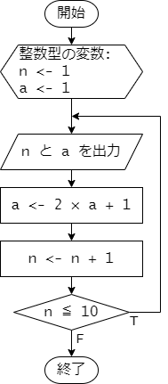

# 第 3 章 : 変数とデータ型

### 例題 3-1 : 変数の宣言と値の代入

次のプログラムは変数を用いたデモプログラムです。

***`variables1.c`***
```c
#include <stdio.h>

int main(void) {
  // (1) 変数の宣言
  char character;
  int i, num;
  double temperature;

  // (2) 変数への値の代入
  character = 'z';
  i = 42;
  num = i + 10;
  temperature = -3.4;

  // (3) 変数の値の表示
  printf("%c\n", character);  
  printf("%d\n", i);
  printf("%d\n", num);
  printf("%f\n", temperature);

  return 0;
}
```

プログラムの説明をしていきます。

変数を用いる際には、まず変数の型(データ型)と変数名を示して宣言する必要があります。
``` c
  // (1) 変数の宣言
  char character;
  int i, num;
  double temperature;
```
これにより、 `char` 型の変数 `character` と、`int` 型の変数 `i` および `num`、
`double` 型の変数 `temperature` が使えるようになりました。
なお、変数を宣言しただけではその変数の値は不定となります。

変数へ値を代入するときは代入演算子 `=` を使います。
```c
  // (2) 変数への値の代入
  character = 'z';
  i = 42;
  num = i + 10;
  temperature = -3.4;
```
代入演算子 `=` の左辺には、代入先となる変数を置き、
右辺には代入する値を持ってきます。

`character = 'z';` が実行されると、`char` 型の変数 `character` に 1 文字の値 `'z'` が代入されます。
同様に `i = 42;` が実行されると、`int` 型の変数 `i` に整数 `42` が代入されます。

代入演算子の右辺に式を持ってくることもできます。
`num = i + 10;` が実行されると右辺が計算され、その計算結果である `52` が `int` 型の変数 `num` に代入されます。
(今、 `i` の値が `42` であったことに注意)

変数の値を表示するには `printf` を用いるとよいです。
`printf` 関数の詳しい使い方については 4 章で説明します。

```c
  // (3) 変数の値の表示
  printf("%c\n", character);  
  printf("%d\n", i);
  printf("%d\n", num);
  printf("%f\n", temperature);
```

プログラムの実行結果を示します。

***`terminal`***
```
z
42
52
-3.400000
```

---
### 例題 3-2 : 変数の宣言時の初期化

変数の宣言時と同時に変数の値を代入することもできます。
これを変数の初期化といいます。
変数の初期値が決まっている変数に対しては、変数の初期化を行うとよいでしょう。

変数の初期化を用いたプログラムを示します。

***`variables2.c`***
```c
#include <stdio.h>

int main(void) {
  // 変数の宣言時に値を設定
  char character = 'P';
  int num = -57;
  double temperature = 12.34;

  printf("%c\n", character);  
  printf("%d\n", num);
  printf("%f\n", temperature);

  return 0;
}
```

プログラムの実行結果を示します。

***`terminal`***
```
P
-57
12.340000
```

---

### 例題 3-3 : 代入による変数の上書き

変数への代入は 1 度だけでなく複数回行うことができます。

次のプログラムでは、`int` 型の変数 `i` と `j` に対して、
変数宣言時に初期化を行った後、
それぞれの変数に対して 2 回代入を行っています。
初期化、1 回目の代入、2 回目の代入それぞれが行われた直後で
変数 `i` と `j` の値がどのように変化しているか、
プログラムを実行して確かめてください。

***`variables3.c`***
```c
#include <stdio.h>

int main(void) {
  // (1) 初期化
  int i = 10;
  int j = 20;
  printf("(1)\n");
  printf("i = %d\n", i);  
  printf("j = %d\n", j);

  // (2) 代入
  i = 30; 
  j = i; 
  printf("(2)\n");
  printf("i = %d\n", i);  
  printf("j = %d\n", j);

  // (3) さらなる代入
  i = i + 2;
  j = 3 * j;
  printf("(3)\n")
  printf("i = %d\n", i);  
  printf("j = %d\n", j);

  return 0;
}
```

プログラムの実行結果を示します。
変数 `i` と `j` の値がどのように変化しているか、
プログラムと対応させて確認してください。

***`terminal`***
```
(1)
i = 10
j = 20
(2)
i = 30
j = 30
(3)
i = 32
j = 90
```

さて、2 回目の代入では代入演算子 `=` の左辺と右辺に同じ変数が現れています。
```c
  // (3) さらなる代入
  i = i + 2;
  j = 3 * j;
```
このような場合は、代入が行われる前の変数の値を使って右辺の式が評価され、
その値が、左辺の変数に代入されることになります。
例えば、`i = i + 2;` が行われる前では、`i` には値 `30` が格納されていますが、
`i = i + 2;` が実行されると `i` の値は `32` となります。

なお、このプログラムの処理の流れをフローチャートで示すと、
以下のようになります。




---
### 例題 3-4 : キャストによる型の変換

`int` 型や `double` 型などの数値を表す型の値や変数は、
キャストと呼ばれる機能を使って一時的に型を変換することができます。
次のプログラムは、キャストによって、`int` 型の値を `double` 型に変換したり、
その逆を行っています。

***`cast.c`***
```c
#include <stdio.h>

int main(void) {
  int i = 256;
  double x = -12.34;
  double d_i;
  int i_x;

  // (1) int 型の値を double 型に変換
  d_i = (double)i;
  printf("i   = %d\n", i);
  printf("d_i = %f\n", d_i);

  // (2) double 型の値を int 型に変換
  i_x = (int)x;
  printf("x   = %f\n", x);
  printf("i_x = %d\n", i_x);

  return 0;
}
```

実行例を示します。

***`terminal`***
```
i   = 256
d_i = 256.000000
x   = -12.340000
i_x = -12
```

`double` 型の値をキャストによって `int` 型に変換したときは、
小数点以下が切り捨てとなります。


---

## 演習

### 演習 3-1 

プログラム `semicircle.c` は半径 `radius` の半円の面積を求めて
表示するプログラムです。
このプログラムは次のフローチャートをもとに作成しました。



プログラム中、変数 `radius` の値を変更して、プログラムを実行し、動作結果を確認してください。

***`semicircle.c`***
```c
#include <stdio.h>

int main(void) {
  double radius, area;

  radius = 3.0; // この値を変更する。

  area = 3.14 * radius * radius / 2;

  printf("The area of semicircle of ");
  printf("radius %f is %f.\n", radius, area);

  return 0;
}
```
---
### 演習 3-2 

プログラム `numerical_sequence.c` は、
初項 \\( a_1 = 1 \\)、漸化式 \\( a_{n+1} = 2 a_n + 1 \\) で定まる数列 \\( a_n \\) を
初項から第 10 項まで計算して表示するプログラムです。
プログラムを実行して、動作結果を確認してください。

***`numerical_sequence.c`***
```c
#include <stdio.h>

#define N_MAX 10

int main(void) {

  int n = 1;
  int a = 1;

  do {
    printf("n = %d : %d\n", n, a);
    a = 2 * a + 1;
    n++;
  } while (n <= N_MAX);

  return 0;
}
```

参考として、処理の流れを表したフローチャートを以下に示します。


