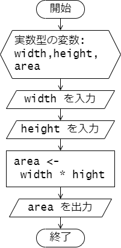
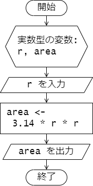

# 第 4 章 : 標準入出力

## 4.1 : 標準出力

### 例題 4-1 : `printf` の使い方

コンソールなどの標準出力へ文字列を出力するときは `printf` 関数を使います。文字列の中に書式を指定して、数値や文字を表示することができます。

次のプログラムは `printf` を用いたデモプログラムです。

***`print01.c`***
```c
#include <stdio.h>

int main(void) {
  printf("Hello, World!\n");
  printf("THE ANSWER is %d!!!\n", 42);
  printf("%d plus %d equals %d\n", -2, 10, -2 + 10);
  printf("PI = %f\n", 3.141);
  printf("%c is my favorite character.\n", 'G');
  
  return 0;
}
```

実行結果は次の通りです。
プログラム中の `printf` を用いているところと
表示された内容との対応を確認してしてください。

***`端末(プログラムの実行結果)`***
```
Hello, World!
THE ANSWER is 42!!!
-2 plus 10 equals 8
PI = 3.141000
G is my favolite character.
```

プログラムの説明を行います。
次のように記述すると、`printf` の第 1 引数で指定された文字列(書式文字列)
`"THE ANSWER is %d!!!\n"` 中の `%d` のところに、第 2 引数で指定された整数値 `42` が
埋め込まれ、`THE ANSWER is 42!!!` と表示されます。


`%d` は出力変換指定子と呼ばれるもののひとつで、
int 型のデータなどの符号付き整数値を 10 進表示で表示したいときに `%d` を用います。
```c
  printf("THE ANSWER is %d!!!\n", 42);
  // THE ANSWER is 42!!! と出力される
```

次のように複数の値を指定して表示することもできます。
```c
  printf("%d plus %d equals %d\n", -2, 10, -2 + 10);
  // -2 plus 10 equals 8 と出力される
```
書式文字列 `"%d plus %d equals %d\n"` 中には 3 個の `%d` がありますが、
左から 1 番目と 2 番目の `%d` のところにはそれぞれ、第 2 引数の `-2`、
第 3 引数の `10` が埋め込まれます。
また、3 番目の `%d` のところには、
第 4 引数に指定した `-2 + 10` が計算された結果の `8` が埋め込まれます。

`Double` 型や `float` 型などの実数値(浮動小数点数)を表示するときは、
出力変換子として `%f` を用います。
```c
  printf("PI = %f\n", 3.141);
  // PI = 3.141000 と出力される
```

また、文字(1バイト文字)を表示するときは、出力変換子として `%c` を用います。
```c
  printf("%c is my favorite character.\n", 'G');
  // G is my favorite character. と出力される
```
書式文字列の `%c` のところに文字 `'G'` が埋め込まれて、
`G is my favorite character.` と表示されます。
なお、C 言語では文字(1バイト文字)は `'a'` のようにシングルクォート `'` で囲んで表現します。

---
### 例題 4-2 変数に格納された値の表示

`printf` では次のプログラムのように、
変数に格納された値を書式文字列に埋め込んで表示することもできます。

***`print02.c`***
```c
#include <stdio.h>

int main(void) {
  char atmark = '@';
  int score = 42;
  double temperature = 12.34;

  printf("%c is my favorite character.\n", atmark);
  printf("Your socre : %d\n", score);
  printf("Todays temperature : %f\n", temperature);

  return 0;
}
```

プログラムの実行結果です。
変数 `atmark` や `score`、`temperature` に代入された値(文字、数値)が
表示されていることがわかります。

***`端末(プログラムの実行結果)`***
```
@ is my favorite character.
Your socre : 42
Todays temperature : 12.340000
```

---
### 例題 4-3 : 表示桁数の指定

出力変換指定子で、表示する数値の桁数などを指定することができます。
また、16進法や指数形式での表示を指定することもできます。

次のプログラムを実行して、プログラム中のコメントを参考に実行結果を確認してください。

***`print03.c`***
```c
#include <stdio.h>

int main(void) {
  int score = 91;
  double value = 123.45678;

  printf("12345678901234567890\n");
  printf("%4d\n", score);   // 整数 4 桁で表示
  printf("%6.2f\n", value); // 実数 全体 6 桁(小数点含む)，小数点以下 2 桁で表示
  printf("%x\n", score);    // 整数 16進法で表示
  printf("%e\n", value);    // 実数 指数形式で表示

  return 0;
}
```

***`端末(実行結果)`***
```
12345678901234567890
  91
123.46
5b
1.234568e+02
```

---

ここで紹介したもの以外にも出力変換指定子は存在します。
`printf` および出力変換指定子の詳細な使い方については以下のリンク先などを参照するとよいでしょう。
- [gnu c library manual, 12.12 Formatted Output](https://www.gnu.org/software/libc/manual/html_mono/libc.html#Formatted-Output)

---

## 4.2 標準入力

### 例題 4-4 : `scanf` の使い方

コンソールなどの標準入力から入力された値を受け取り、
変数に格納したい場合、 `scanf` 関数を用います。

次のプログラムは、標準入力から入力された 1 文字(1バイト文字)を
受け取り、その文字を `"The character you entered : "` に続けて
表示するものです。

***`scan01.c`***
```c
#include <stdio.h>

int main(void) {
  char character; // 1 文字を格納する変数 character を宣言
  
  scanf("%c", &character); // 変数 character に入力された文字を格納

  printf("The character you entered : %c\n", character);

  return 0;
}
```

プログラムの実行結果です。
1 行目はユーザーからの入力です。

***`端末(プログラムの実行結果例)`***
```
Q
The character you entered : Q
```

`scanf` は次のように書式文字列と変数のポインタを渡して用います。
この文が実行されると、入力された文字が `char` 型の変数 `character` に格納されます。
(変数 `character` は事前に `char character;` と宣言されていることに注意してください。)
```c
  scanf("%c", &character) // 変数 character に入力された文字を格納
```
第 1 引数の書式文字列には入力する値の形式を入力変換指定子で指定します。
文字(1バイト文字)の場合、入力変換指定子は `%c` となります。
入力変換子と出力変換しはほぼ同じものとなります。

第 2 引数には、入力された値を格納する変数のポインタを渡します。
ポインタとは、その変数が主記憶装置 (メモリー) 上のどこに割り当てられているか
その場所(アドレス)を示す値のことです (詳しくは 3 学年で学びます)。
変数名の前に `&` をつけるとその変数のポインタが得られます。
ここでは、`char` 型の変数 `character` に入力された文字を格納したいので、
変数 `character` のポインタ `&character` を `scanf` の第 2 引数に渡しています。

`scanf` では入力された値を格納したい変数に `&` をつけて
ポインタを渡すことを忘れないようにしましょう。

---


### 例題 4-3 : 実数値の入力

`scanf` を使って、`double` 型の変数へ入力された値を格納する場合、
入力変換子は `%lf` を使います。(`%f` ではないことに注意)

次のプログラムは、2 つの実数値が入力されると、
それらを底辺と高さとする長方形の面積を計算して出力するプログラムです。

***`rectangle.c`***
```c
#include <stdio.h>

int main(void) {
  double width, height;
  double area;

  printf("Enter width height : \n");

  scanf("%lf %lf", &width, &height);

  area = width * height;
  printf("Area of the rectagle : %f\n", area);

  return 0;
}
```

`scanf` では入力を複数受け取って、それぞれを別の変数に格納することもできます。
```c
  scanf("%lf %lf", &width, &height);
```
この `scanf` の文が実行されると、標準入力からの入力待ちとなり、
ユーザーから 2 つの値が順に入力されると、
はじめに入力された値は変数 `width` に格納され、
次に入力された値は変数 `height` に格納されます。

実行結果の例は次の通りです。
2 行目の `2.3` と 3 行目の `10.0` がユーザーからの入力です。
`scanf` により、それぞれの値が `double` 型の変数 `width` と `height` に格納されます。

***`端末(プログラムの実行例)`***
```
Enter width height : 
2.3
10.0
Area of the rectagle : 23.000000
```

参考に、プログラムの処理の流れを表したフローチャートを示します。



---

`scanf` や入力変換指定子の詳細な使い方については以下のリンク先などを参照するとよいでしょう。
- [gnu c library manual, 12.14 Formatted Input](https://www.gnu.org/software/libc/manual/html_mono/libc.html#Formatted-Input)

---

## 演習

### 演習 4-1 

標準入力より 1 つの実数値を受け取ると、
その値を半径とする円の面積を計算し出力するプログラムを作成し、
動作を確認してください。

プログラムの処理の流れは以下のフローチャートのようになります。



実行例を示します。
1 行目はユーザーからの入力で、2 行目がプログラムからの出力です。

***`terminal`***
```
5.0
78.500000
```

---
### 演習 4-2

標準入力から文字( char 型の値)を 3 つ受け取ったら、
受け取った 3 つの文字を横に逆順に横に並べて出力するプログラムを作成し、
動作を確認してください。

実行例を以下に示します。
1 ~ 3 行目はユーザーからの入力で、4 行目はプログラムの出力です。

***`端末(実行例)`***
```
a
b
c
cba
```

---
### 演習 4-3 

次は掛け算の九九の表を表示するプログラムです。
プログラムを作成して実行し、その動作を確認しましょう。

```c
#include <stdio.h>

int main(void) {
  for (int i = 1; i <= 9; i++) {
    for (int j = 1; j <= 9; j++) {
      printf("%3d", i * j);
    }
    printf("\n");
  }

  return 0;
}
```