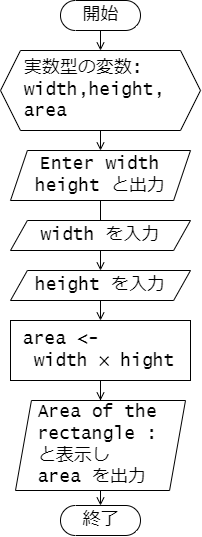

# 第 4 章 : 標準入出力

## 4.1 : 標準出力

### 例題 4-1 : 
```c
#include <stdio.h>

int main(void) {
  printf("Hello, World!\n");
  printf("THE ANSWER is %d!!!\n", 42);
  printf("%d plus %d equals %d\n", -2, 10, -2 + 10);
  printf("PI = %lf\n", 3.141);
  printf("%c is my favorite character.\n", 'G');
  
  return 0;
}
```

***`terminal`***
```
Hello, World!
THE ANSWER is 42!!!
-2 plus 10 equals 8
PI = 3.141000
A is my favolite character.
```

### 例題 4-2
```c
#include <stdio.h>

int main(void) {
  char atmark = '@';
  int score = 42;
  double temperature = 12.34;

  printf("%c is my favorite character.\n", atmark);
  printf("Your socre : %d\n", score);
  printf("Todays temperature : %lf\n", temperature);

  return 0;
}
```

***`terminal`***
```
@ is my favorite character.
Your socre : 42
Todays temperature : 12.340000
```

---

### 例題 4-3 :

```c
#include <stdio.h>

int main(void) {
  int score = 91;
  double value = 123.45678;

  printf("12345678901234567890\n");
  printf("%4d\n", score);     // 整数 4 桁で表示
  printf("%6.2lf\n", value);  // 実数 全体 6 桁(小数点含む)，小数点以下 2 桁で表示
  printf("%x\n", score);      // 整数 16進法で表示
  printf("%e\n", value);      // 実数 指数形式で表示

  return 0;
}
```

***`terminal`***
```
12345678901234567890
  91
123.46
5b
1.234568e+02
```

---

### 例題 4-3 :

```c
#include <stdio.h>

int main(void) {
  char character;
  
  scanf("%c", &character);

  printf("The character you entered : %c\n", character);

  return 0;
}
```

***`terminal`***
```
Q
The character you entered : Q
```

---

### 例題 4-3 :

```c
#include <stdio.h>

int main(void) {
  double width, height;
  double area;

  printf("Enter width height : \n");

  scanf("%lf %lf", &width, &height);

  area = width * height;
  printf("Area of the rectagle : %lf\n", area);

  return 0;
}
```



***`terminal`***
```
Enter width height : 
2.3 10.0
Area of the rectagle : 23.000000
```

---

## 演習

### 演習 4-1

標準入力から文字( char 型の値)を 3 つ受け取ったら、
受け取った 3 つの文字を横に逆順に横に並べて出力するプログラムを作成し、
動作を確かめてください。

実行例を以下に示します。
1 ~ 3 行目はユーザーからの入力で、4 行目はプログラムの出力です。

***`terminal`***
```
a
b
c
cba
```

### 演習 4-2

```c
#include <stdio.h>

int main(void) {
  for (int i = 1; i <= 9; i++) {
    for (int j = 1; j <= 9; j++) {
      printf("%3d", i * j);
    }
    printf("\n");
  }

  return 0;
}
```