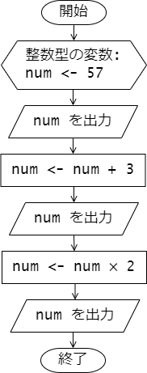

# 第 5 章 : 演算子

## 5.1 算術演算子

### 例題 5-1 : 算術演算

算術演算として加算 `+` 、減算 `-` 、乗算 `*` 、除算 `/` 、剰余 `%` などが使えます。
これらを用いたでもプログラムを次に示します。

***`arithmetic.c`***
```c
#include <stdio.h>

int main(void) {
  int a = 8, b = -2, c = 3;
  printf("a + b = %d\n", a + b);  // -> 6
  printf("(a - b) * c + 12 = %d\n", (a - b)  * c + 12); // -> 42
  printf("a mod c = %d\n", a % c);  // -> 2 (a を c で割った余り)

  double pi = 3.14, e = 2.71;
  printf("pi + e = %f\n", pi + e);  // -> 5.850000
  printf("pi / e = %f\n", pi / e);  // -> 1.168672
  printf("pi / a = %f\n", pi / a);  // -> 0.392500

  return 0;
}
```

加減算と乗除算が混じった式では、数学での数式と同様に、
乗算 `*` と除算 `/` は加算 `+` や減算 `-` よりも優先度が高く先に計算されます。
また、これらの算術演算は左結合性を持ちます(左から順番に計算されます)。
括弧 `(` ` )` を用いて、`(a - b)  * c + 12` の式のように計算の優先順位を制御することができます。

実行結果を示します。

***`terminal`***
```
a + b = 6
(a - b) * c + 12 = 42
a mod c = 2
pi + e = 5.850000
pi / e = 1.158672
pi / a = 0.392500
```

---

### 例題 5-2 整数同士の割り算

算術演算では、整数型の値同士の演算を行った結果の値は整数型となります。
それ以外の組み合わせでは演算結果の値は実数型となります。
例えば `int` 型の値と `double` 型の値の演算結果は `double` 型となります。

特に、整数同士の割り算については注意が必要です。
整数同士の割り算の結果は整数となり、小数点以下の値は切り捨てられます。

次のプログラムを実行して動作を確かめましょう。

***`division.c`***
```c
#include <stdio.h>

int main(void) {
  int a = 8, b = 3;

  int x1 = a / b; // -> 2
  double x2 = (double) (a / b); // -> 2.000000
  double x3 = (double) a / b;   // -> 2.666667

  printf("x1 = %d\n", x1);
  printf("x2 = %f\n", x2);
  printf("x3 = %f\n", x3);
  
  return 0;
}
```

まず、`int x1 = a / b;` の部分についてみていきます。 
`a = 8` と `b = 3` は共に`int`型の整数ですので、その割り算 `a / b` は数学的には
`2.66666...` となりますが、小数点以下が切り捨てられて `2` と評価されますなります。
したがって、`x1` には `2` が代入されます。

次に、`double x2 = (double) (a / b);` の部分についてみていきます。
`a / b` は `2` となりますが、`(double)` によって値が `double` 型に 
変換され(キャスト)、変数 `x2` には `2.0` (`double`型の値)が代入されます。

最後に、`double x3 = (double) a / b;` の部分についてみていきます。
`a` は `int` 型ですが、`(double)` によって値が `double` 型に変換されます。
したがって、ここでの割り算は実数としての割り算が行われます。その結果は `double` 型となり、`x3` には `2.666667` が代入されます。
このように、整数同士の割り算を実数として行いたい場合は、
分子もしくは分母の少なくともどちらかの値を実数型にキャストする必要があります。


プログラムの実行結果は次のようになります。

***`terminal`***
```
x1 = 2
x2 = 2.000000
x3 = 2.666667
```
---

## 5.2 論理演算子

### 例題 5-3 : ビット単位の論理演算

次のプログラムは、ビット単位の論理演算を行うプログラムです。

***`bitwiseOp.c`***
```c
#include <stdio.h>

int main(void) {
  unsigned char a = 0x0F; // 00001111
  unsigned char b = 0x3A; // 00111010

  unsigned char a_and_b = a & b;  // -> 00001010 = 0A
  unsigned char a_or_b  = a | b;  // -> 00111111 = 3F
  unsigned char a_xor_b = a ^ b;  // -> 00110101 = 35
  unsigned char not_b   = ~b;     // -> 11000101 = C5

  printf("a & b = %02X\n", a_and_b);
  printf("a | b = %02X\n", a_or_b);
  printf("a ^ b = %02X\n", a_xor_b);
  printf("~b    = %02X\n", not_b);
  
  return 0;
}
```

`a` と `b` は `unsigned char` 型(符号なし 8 bit 整数)の変数で、
それぞれ `0x0F` と `0x3A` という 16 進数で表される値が代入されています。
`0x` は 16 進数を表す接頭辞です。
`0x0F` は `00001111` という 2 進数を表し、
`0x3A` は `00111010` という 2 進数を表します。

`a & b` は `a` と `b` のビット単位の論理積( AND )を表します。
`a = 00001111` と `b = 00111010` のビット単位の論理積は `00001010` なります。
したがって、`a & b` の結果は、 16 進数表示で表すと `0x0A` となります。

なお、演算結果を表示している `printf("a & b = %02X\n", a_and_b);` の
書式文字列にある出力変換指定 `%02X` は、`a_and_b` の値を 16 進数で 2 桁表示することを表します。
`%02X` の `02` は 2 桁表示(先頭0埋め)を表し、`X` は 16 進数表示を表します。

`a | b` は `a` と `b` のビット単位の論理和( OR )を表します。
また、`a ^ b` は `a` と `b` のビット単位の排他的論理和( XOR )を表します。
`~b` は `b` のビット単位の否定( NOT )を表します。

実行結果を示します。

***`terminal`***
```
a & b = 0A
a | b = 3F
a ^ b = 35
~b    = C5
```

---
## 5.3 比較演算子

### 例題 5-4 : 比較演算

数値や変数の値の比較には、比較演算子を用います。
演算結果は真偽値(真 `1` または偽 `0`)となります。

次のプログラムは比較演算子を用いたプログラムです。

***`comparisionOp.c`***
```c
#include <stdio.h>

int main(void) {
  int three = 3;

  printf("three == 3 : %d\n", three == 3); // -> 1 (true)
  printf("three != 3 : %d\n", three != 3); // -> 0 (false)
  printf("three > 3  : %d\n", three > 3);  // -> 0 (false)
  printf("three >= 3 : %d\n", three >= 3); // -> 1 (true)
  printf("three < 3  : %d\n", three < 3);  // -> 0 (false)
  printf("three <= 3 : %d\n", three <= 3); // -> 1 (true)

  return 0;
}
```

このプログラムでは `int` 型の変数 `three` には `3` が代入されています。
比較演算子 `==` を使った `three == 3` の比較では、
右辺と左辺の値が等しいかどうかが評価されます。
もちろん両者の値は等しいので、この比較の結果は真 ( True ) を表す整数値 `1` となります。
(`==` ではなく `=` と書くと、代入演算となりますので注意してください。)

一方で、`!=` は右辺と左辺が等しくないときに真 ( True ) を返す比較演算となります。
`three != 3` の比較では、今、右辺と左辺の値が等しくなっているので、
この比較の結果は偽 ( False ) を表す整数値 `0` となります。

プログラム中で用いた比較演算子の一覧を示します。

| 比較演算子(C言語) | 意味(数学表記) |
|:---:|:---:|
| `==` | \\( = \\) |
| `!=` | \\( \neq \\) |
| `>`  | \\( > \\) |
| `>=` | \\( \geq \\) |
| `<`  | \\( < \\) |
| `<=` | \\( \leq \\) |


プログラムの実行結果を示します。

***`terminal`***
```
three == 3 : 1
three != 3 : 0
three > 3  : 0
three >= 3 : 1
three < 3  : 0
three <= 3 : 1
```
---

### 例題 5-5 : 論理演算　

論理演算子を用いると、複数の比較演算を組み合わせて複雑な条件を表現することができます。
変数や数値に対して論理演算を行うときは、整数値 `0` を偽 ( False ) とし、
それ以外の値を真 ( True ) として扱います。

次のプログラムは論理演算子を用いたプログラムです。

***`logicOp.c`***
```c
#include <stdio.h>

int main(void) {
  int three = 3;

  printf(" three == 3 : %d\n", three == 3); // -> 1 (true)
  printf(" three > 3  : %d\n", three > 3);  // -> 0 (false)

  printf(" (three == 3) && (three > 3) : %d\n", (three == 3) && (three > 3)); // -> 0 (false)
  printf(" (three == 3) || (three > 3) : %d\n", (three == 3) || (three > 3)); // -> 1 (true)
  printf(" !(three == 3)               : %d\n", !(three == 3));               // -> 0 (false)

  return 0;
}
```

`&&` は論理積( AND )、`||` は論理和(OR)、`!` は論理否定(NOT)を表します。
`&&` は左辺と右辺の両方が真 ( True ) のときに真 ( True ) を返します。
`||` は左辺と右辺のどちらかが真 ( True ) のときに真 ( True ) を返します。
`!` は右辺の真偽を反転します。

ビット単位の論理演算子との違いに注意してください。

このプログラムの実行結果を示します。

***`terminal`***
```
 three == 3 : 1
 three > 3  : 0
 (three == 3) && (three > 3) : 0
 (three == 3) || (three > 3) : 1
 !(three == 3)               : 0
```
---

## 5.4 増減演算子

### 例題 5-6 : インクリメント・デクリメント

整数型の変数の値を 1 だけ増減させるには、
増分演算子(インクリメント) `++` 減分演算子(デクリメント) `--` を用います。

次のプログラムを実行し、
インクリメントやデクリメントが行われるたびに
変数 `a` の値がどのように変化するか確認してください。

***`incdec.c`***
```c
#include <stdio.h>

int main(void) {
  int a = 57;

  printf("a = %d\n", a); // -> 57
  a++; // a = a + 1 と同等　(++a も可)
  printf("a = %d\n", a); // -> 58
  a--; // a = a - 1 と同等　(--a も可)
  a--;
  printf("a = %d\n", a); // -> 56

  return 0;
}
```

`a++` が実行されると変数 `a` の値が 1 増えます。
すなわち、代入 `a = a + 1` と同じです。
デクリメント `a--` も同様です。

プログラムの実行結果を示します。

***`terminal`***
```
a = 57
a = 58
a = 56
```
---

### 例題 5-7 : 前置・後置の違い

増減演算子は、変数の前に置くことも後ろに置くこともできます。
どちらも、変数の値を 1 増減させるという働きは同じですが、
その処理には違いがあります。

次のプログラムは、その違いを確認するプログラムです。

***`pre_post.c`***
```c
#include <stdio.h>

int main(void) {
  int n, m;

  n = 42;
  printf("n = %d\n", n);
  m = n++; // m = n; n = n + 1; と同等 -> m = 42, n = 43
  printf("m = %d, n = %d\n", m, n);

  n = 42;
  printf("n = %d\n", n); // -> 42
  m = ++n;  // n = n + 1; m = n; と同等 -> m = 43, n = 43
  printf("m = %d, n = %d\n", m, n);

  return 0;

}
```

まず、増減演算子を変数の後に置いた場合をみていきます。
変数 `m` への代入 `m = n++;` では、
はじめに変数 `m` に変数 `n` の値が代入されます(`m = n`)。
その後、変数 `n` の値が 1 増えます(`n = n + 1`)。

次に、増減演算子を変数の前に置いた場合をみていきます。
変数 `m` への代入 `m = ++n;` では、
はじめに変数 `n` の値が 1 増えます(`n = n + 1`)。
その後、変数 `m` に変数 `n` の値が代入されます(`m = n`)。

プログラムの実行結果は次の通りです。

```
n = 42
m = 42, n = 43
n = 42
m = 43, n = 43
```
---

## 5.5 シフト演算子

### 例題 5-8 : シフト演算

シフト演算子 `<<` と `>>` は、ビット単位での左シフトと右シフトを行います。
演算子の左辺にはシフトする値、右辺にはシフトするビット数を指定します。

次のプログラムはシフト演算子を用いたプログラムです。

***`shiftOp.c`***
```c
#include <stdio.h>

int main(void) {
  unsigned char a = 0xAF; // -> 10101111

  unsigned char a_shifted_left  = a << 2; // -> 10111100 = BC
  unsigned char a_shifted_right = a >> 2; // -> 00101011 = 2B

  printf("a      = %02X\n", a);
  printf("a << 2 = %02X\n", a_shifted_left);
  printf("a >> 2 = %02X\n", a_shifted_right);

  return 0;
}
```

`a << 2` は `a` の値のビットを左に 2 ビットシフトした値となります。`a` 自身の値は変化しません。
今 `a` の値は2進数表記で `10101111` (16 進数表示で `0xAF` ) となっているので、
これを左に 2 ビットシフトすると `10111100` (16 進数表示で `0xBC` ) となります。
(左にあふれたビットは無視され、右には `0` が埋められます。)

同様に`a >> 2` は `a` の値のビットを右に 2 ビットシフトします。

プログラムの実行結果は次のようになります。

***`terminal`***
```
a      = AF
a << 2 = BC
a >> 2 = 2B
```

---

## 5.6 代入演算子

### 例題 5-9 : 代入演算

代入演算子 `=` は左辺の変数へ右辺の値を代入するものですが、
代入演算と算術演算を組み合わせて同時に行うこともできます。

次のプログラムは加算演算や乗算演算を代入演算子と組み合わせて行うプログラムです。

***`assignmentOp.c`***
```c
#include <stdio.h>

int main(void) {
  int num = 57;
  printf("num = %d\n", num); // -> 57

  num += 3; // num = num + 3 と同じ
  printf("num = %d\n", num); // -> 60

  num *= 2; // num = num * 2 と同じ
  printf("num = %d\n", num); // -> 120

  return 0;
}
```

プログラム中の `num += 3;` は `num = num + 3;` と同じ動作です。
同様に、`num *= 2;` は `num = num * 2;` と同じ動作となります。

プログラムの処理の流れを示すフローチャートを示します。
変数 `num` の値がどのように変化するかを実行結果と合わせて確認してください。



プログラムの実行結果です。

***`terminal`***
```
num = 57
num = 60
num = 120
```

他の算術論理演算も代入演算と組み合わせて使うことができます。
どのようなものがあるかについては、授業資料や以下のリンク先などを参照してください。
- [The GNU C reference manual, 3.2 Assignment Operators](https://www.gnu.org/software/gnu-c-manual/gnu-c-manual.html#Assignment-Operators)

---

## 5.7 条件演算子

### 例題 5-10 : 条件演算

条件演算子 `?:` を用いると、条件によって値を選択することができます。
次のプログラムは条件演算子を用いたプログラムです。

***`relu.c`***
```c
#include <stdio.h>

int main(void) {
  double val_input, val_output;

  scanf("%lf", &val_input);
  val_output = (val_input > 0) ? val_input : 0;
  printf("val_output = %f\n", val_output);
  
  return 0;
}
```

`(val_input > 0L) ? val_input : 0` の部分が
条件演算子 `?:` を用いているところです。
`?` の左側に示された条件 `val_input > 0` が真 ( True ) であれば、
`:` の左側にある値 `val_input` を返し、偽 ( False ) であれば `:` の右側の値 `0` が返されます。

プログラムの実行例を示します。
まずは、`val_input` に正の値 `3.14` を入力したときの実行結果です。
1 行目はプログラムへの入力です。

***`terminal`***
```
3.14
val_output = 3.140000
```

`val_input` に負の値 `-1.414` を入力したときの実行結果です。
こちらも 1 行目はプログラムへの入力です。

***`terminal`***
```
-1.414
val_output = 0.000000
```

---

## 演習

### 演習 5-1

2 人の年齢を入力すると、
その人たちの年齢の平均を出力するプログラムを作成し、
プログラムの動作を確認してください。

入力する年齢は 0 以上の整数値とします。
出力される平均年齢は小数点以下 1 桁まで表示するようにしてください。

期待される実行例は次の通りです。
1 行目と 2 行目はプログラムへの入力で、
2 人の年齢が整数値で入力されています。
3 行目が出力で、
2 人の年齢の平均が小数点以下 1 桁まで表示されています。

***`terminal`***
```
17
8
Average age : 12.5
```
---
