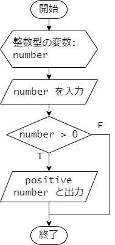
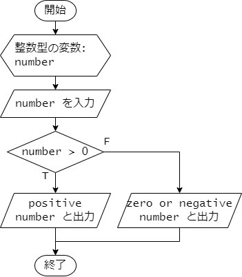
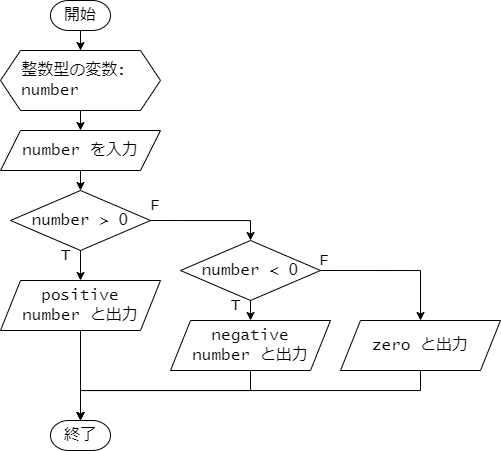
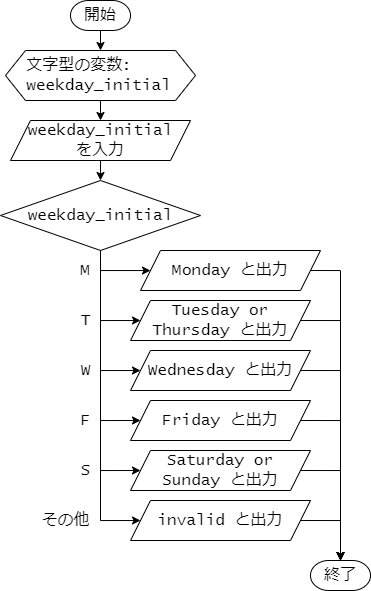
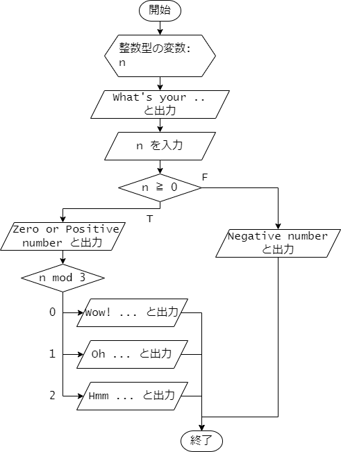

# 第 6 章 : 分岐処理

## 6.1 : if 文

### 例題 6-1 : if 文

ある条件が成り立つか、
成り立たないかによって行う処理を分岐させるには、
if 文を使います。

次のプログラムは、if 文を使って、
入力された数値が正の数かどうかを判定し、
正の数であれば `positive number` と表示し、
そうでなければ何も表示しないプログラムです。

***`positive.c`***
```c
#include <stdio.h>

int main(void) {
  int number;

  scanf("%d", &number);

  if (number > 0) {
    printf("positive number\n");
  }

  return 0;
}
```

`if` の後に続く条件式 `number > 0` が真のとき、
`{` と `}` で囲まれたブロック内の文が実行されます。
すなわち、`mumber` が正の数の時は、
`printf("positive number\n");` が実行され、
`positive number` と表示されます。

条件式が偽、すなわち、`mumber` がゼロまたは負の数の場合は、
ブロック内の文は実行されず、なにも表示されません。

このプログラムの処理の流れを示すフローチャートを次に示します。



プログラムの実行結果を示します。
1 行目は、入力された数値を表しています。
正の数を入力した場合は、`positive number` と表示されます。

***`terminal`***
```
42
positive number
```

負の数を入力した場合は、何も表示されません。
***`terminal`***
```
-1
```

---

### 例題 6-2 : else 文

if 文の後に `else` を続けることで、
条件式が偽の場合に実行する文を指定できます。

次のプログラムは、入力された数値が正の数かどうかを判定し、
正の数であれば `positive number` と表示し、
そうでなければ `zero or negative number` と表示するプログラムです。

***`positive_negative.c`***
```c
#include <stdio.h>

int main(void) {
  int number;

  scanf("%d", &number);

  if (number > 0) {
    printf("positive number\n");
  } else {
    printf("zero or negative number\n");
  }

  return 0;
}
```

if 文の条件式 `number > 0` が成り立つときは、
続くブロック内の文 `printf("positive number\n");` が実行されます。
条件式が成り立たないとき、すなわち、`number` がゼロまたは負の数のときは、
`else` の後に続くブロック内の文
`printf("zero or negative number\n");` が実行されます。

このプログラムの処理の流れを示すフローチャートを次に示します。




プログラムの実行結果を示します。
1 行目は、入力された数値を表しています。
正の数を入力した場合は次のように、`positive number` と表示されます。

***`terminal`***
```
42
positive number
```

負の数を入力した場合は、`zero or negative number` と表示されます。

***`terminal`***
```
-1
zero or negative number
```

ゼロを入力した場合も、`zero or negative number` と表示されます。

***`terminal`***
```
0
zero or negative number
```

---

### 例題 6-3 : else if 文

if 文の後に `else if` を続けることで、
最初の条件式が偽の場合に、
さらに別の条件式を指定して処理を分岐させることができます。

次のプログラムは、入力された数値が正の数かどうかを判定し、
正の数であれば `positive number` 、
負の数であれば `negative number` 、
ゼロであれば `zero` と表示するプログラムです。

***`positive_negative_zero.c`***
```c
#include <stdio.h>

int main(void) {
  int number;

  scanf("%d", &number);

  if (number > 0) {
    printf("positive number\n");
  } else if (number < 0) {
    printf("negative number\n");
  } else {
    printf("zero\n");
  }

  return 0;
}
```

if 文の最初の条件式 `number > 0` が成り立つときは、
続くブロック内の文 `printf("positive number\n");` が実行されます。
条件式が成り立たないときは、`else if` に続く条件式 `number < 0` が評価されます。
この条件式 `number < 0` が成り立つときは、
続くブロック内の文 `printf("negative number\n");` が実行されます。
最初の条件式も、2 番目の条件式も成り立たないときは、
最後の `else` に続くブロック内の文 `printf("zero\n");` が実行されます。

このプログラムの処理の流れを示すフローチャートを次に示します。



プログラムの実行結果を示します。
1 行目は、入力された数値を表しています。
正の数を入力した場合は次のように、`positive number` と表示されます。

***`terminal`***
```
42
positive number
```

負の数を入力した場合は、`negative number` と表示されます。

***`terminal`***
```
-1
negative number
```

ゼロを入力した場合は、`zero` と表示されます。

***`terminal`***
```
0
zero
```

### 例題 6-4 : 複雑な条件式

if 文の条件式には、複数の条件を組み合わせることができます。
次のプログラムは、室温として実数値を入力したときに、
入力された数値が 15.0 以上 25.0 未満であれば、
`comfortable` と表示し、
そうでなければ `uncomfortable` と表示するプログラムです。

***`room_temperature.c`***
```c
#include <stdio.h>

int main(void) {
  double temperature;
  
  printf("temperature? ");
  scanf("%lf", &temperature);
  
  if (15.0 <= temperature && temperature < 25.0) {
    printf("comfortable\n");
  } else {
    printf("uncomfortable\n");
  }

  return 0;
}
```

if 文の条件式 `15.0 <= temperature && temperature < 25.0` は、
論理積 `&&` ( AND ) で結合された 2 つの条件式 `15.0 <= temperature` と
`temperature < 25.0` が両方とも成り立つときに真となります。
すなわち、`temperature` が 15.0 以上 25.0 未満のときに真となります。

条件式を `15.0 <= temperature < 25.0` のようには記述しないことに注意してください。
このように記述すると意図した通りには動作しません。


プログラムの実行結果を示します。
1 行目の数値の部分は、入力された数値を表しています。

21.5 を入力した場合は、条件式が真となるので、
次のように、`comfortable` と表示されます。

***`terminal`***
```
temperature? 21.5
comfortable
```

30.0 を入力した場合は、条件式が偽となるので、
次のように、`uncomfortable` と表示されます。

***`terminal`***
```
temperature? 30.0
uncomfortable
```

---

## 6.2 : switch 文

### 例題 6-5 : switch 文

条件によって分ける処理の分岐が多い場合、
switch 文を使うとプログラムを簡潔に書くことができます。

次のプログラムは、`char` 型の値を入力して、
入力された値に応じて曜日を表示するプログラムです。
プログラムの動作をより詳しく説明すると、
各曜日 Monday, Tuesday, Wednesday, Thursday, Friday, Saturday, Sunday の
頭文字の大文字 `M`, `T`, `W`, `F`, `S` を入力すると
該当する曜日を表示し、それ以外の文字を入力すると `invalid` と表示します。

***`weekday1.c`***
```c
#include <stdio.h>

int main(void) {
  char weekday_initial;

  scanf("%c", &weekday_initial);

  switch (weekday_initial) {
    case 'M':
      printf("Monday\n");
      break;
    case 'T':
      printf("Tuesday or Thursday\n");
      break;
    case 'W':
      printf("Wednesday\n");
      break;
    case 'F':
      printf("Friday\n");
      break;
    case 'S':
      printf("Saturday or Sunday\n");
      break;
    default:
      printf("invalid\n");
      break;
  }

  return 0;
}
```

switch 文ではまず制御式を指定します。
このプログラムでは、`char` 型の変数 `weekday_initial` を指定しています。
続く`{` と `}` で囲まれたブロック内には、
switch 文で行う処理を記述しますが、
このブロック内には処理を分岐させるために、分岐先を示す
 `case` および `default` で構成される複数のラベルを記述します。
このプログラムでは `case 'M':` から `case 'S':` までの
5 つの `case` を使ったラベルと
`default:` がラベルとなっています。

switch 文では制御式を評価し、
その値に応じて、`case` で指定した値と一致するかどうかを上から順に調べます。
一致する `case` が見つかったら、そこへ処理がジャンプします。
なお、制御式で評価される値、および `case` で指定する値は、
整数値(`int` 型の値など)や文字(`char` 型の値)である必要があります。

このプログラムにおいては、例えば、`weekday_initial` が `'T'` であれば、
`case 'T':` に処理がジャンプし、
`printf("Tuesday or Thursday\n");` が実行されます。
続く `break` は、switch 文を抜けるための命令です。
これにより、switch 文のブロックを抜けるので、
続く `case 'W':` 以降の処理は実行されません。
(`break` がないと、次の `case` の処理が続けて実行されてしまいます。)

制御式で評価した値と一致する `case` が見つからない場合は、
`default:` に処理がジャンプします。
プログラムでは、`weekday_initial` が `'t'` である場合には、
`case` で指定した値と一致するものがないため、
`default:` に処理がジャンプし、
`printf("invalid\n");` が実行されます。


プログラムの処理の流れをフローチャートに示すと次のようになります。



プログラムの実行結果を示します。
1 行目は、入力された文字を表しています。

`M` を入力した場合の実行結果です。

***`terminal`***
```
M
Monday
```

`T` を入力した場合の実行結果です。

***`terminal`***
```
T
Tuesday or Thursday
```

小文字の `t` を入力した場合の実行結果です。
この時はどの `case` にも当てはまらないので、
`default` に処理がジャンプし、`invalid` と表示されます。

***`terminal`***
```
t
invalid
```

---

### 例題 6-6 : switch 文の fall-through

例題 6-5 のプログラムでは、
各曜日 Monday, Tuesday, Wednesday, Thursday, Friday, Saturday, Sunday の
頭文字の大文字 `M`, `T`, `W`, `F`, `S` を入力すると
該当する曜日を表示してくれました。
次のプログラムは、各曜日の頭文字の小文字 `m`, `t`, `w`, `f`, `s` 
の入力にも対応できるよう拡張したものです。

***`weekday2.c`***
```c
#include <stdio.h>

int main(void) {
  char weekday_initial;

  scanf("%c", &weekday_initial);

  switch (weekday_initial) {
    case 'M':
    case 'm':
      printf("Monday\n");
      break;
    case 'T':
    case 't':
      printf("Tuesday or Thursday\n");
      break;
    case 'W':
    case 'w':
      printf("Wednesday\n");
      break;
    case 'F':
    case 'f':
      printf("Friday\n");
      break;
    case 'S':
    case 's':
      printf("Saturday or Sunday\n");
      break;
    default:
      printf("invalid\n");
      break;
  }

  return 0;
}
```

このプログラム中の switch 文では、例題 6-6 と同様に
char 型の変数 `weekday_initial` を制御式として指定しています。

いま、`weekday_initial` の値が `T` である場合を考えます。  
このとき、ラベル `case 'T':` の場所に処理がジャンプします。
`case 'T':` の後には、命令が無く、特に `break` もありません。
したがって、処理は次の `case 't':` の場所に続きます。
ここには、`printf("Tuesday or Thursday\n");` という命令があるので、
`Tuesday or Thursday` と表示されます。
続いて、`break` があるので、switch 文を抜けます。

仮に `weekday_initial` の値が `t` であった場合には、
処理が `case 't':` にジャンプするので、
`Tuesday or Thursday` と表示され、続く `break` により、
switch 文での処理は終了します。

このように、`case` の後に `break` がない場合では、
処理は次の `case` に続きます。


このプログラムの実行例を示します。
1 行目は、入力された文字を表しています。

`T` を入力した場合の実行結果です。

***`terminal`***
```
T
Tuesday or Thursday
```

`t` を入力した場合の実行結果です。

***`terminal`***
```
t
Tuesday or Thursday
```

大文字の `T` と小文字の `t` のどちらを入力した場合も、
`Tuesday or Thursday` と表示されているのがわかります。

---

### 例題 6-7 : if 文と switch 文の混在

if 文どうしや switch 文どうしを組み合わせたり、
if 文と switch 文を組み合わせることことで、
複雑な分岐処理を実現することができます。

次のプログラムは、if 文と switch 文を組み合わせた例です。
ユーザーから入力された整数値に応じて、
表示を変えるプログラムです。

***`if_switch.c`***
```c
#include <stdio.h>

int main(void) {
  int n;

  printf("What's your favorite number? ");
  scanf("%d", &n);

  if (n >= 0) {
    printf("Zero or Positive number.\n");
    switch (n % 3) {
      case 0:
        printf("Wow! You've entered a multiple of 3! That's a shining and magnificent number, indeed! Well done! \n");
        break;
      case 1:
        printf("Oh. That's a decently good number.\n");
        break;
      case 2:
        printf("Hmm. That's not such a bad number.\n");
        break;
    }
  } else {
    printf("Negative number.\n");
  }

  return 0;
}
```

このプログラムでは、まず if 文で、
`int` 型の変数 `n` の値に対する条件 `n >= 0` 
が真であるかどうかを判定して、
次の1. 2. のように分岐が行われます。

1. `n >= 0` が真である場合 :
  まず `Zero or Positive number.` と表示されます。
  続いて、switch 文により `n` を 3 で割った余り (`n % 3`) に応じてさらに分岐が行われます。
    * `n % 3` の値が 0 の場合 :
      `Wow! ...` と表示されます。
    * `n % 3` の値が 1 の場合 :
      `Oh. ...` と表示されます。
    * `n % 3` の値が 2 の場合 :
      `Hmm. ...` と表示されます。

2. `n >= 0` が偽である場合 :
  `Negative number.` と表示されます。

プログラムのフローチャートを示します。
フローチャートと、
プログラム中の if 文と switch 文を見比べて、
構造が一致していることを確認してください。




プログラムの実行結果を示します。
1行目の行末の数値が、入力された数値を表しています。

`n` として 42 を入力した場合の実行結果です。
42 は 0 以上の数なので、`Zero or Positive number.` と表示されます。
さらに、42 を 3 で割った余りは 0 なので、
`Wow! ...` と表示されます。

***`terminal`***
```
What's your favorite number? 42
Zero or Positive number.
Wow! You've entered a multiple of 3! That's a shining and magnificent number, indeed! Well done!
```


43 を入力した場合の実行結果です。
43 は 0 以上の数なので、`Zero or Positive number.` と表示されます。
43 を 3 で割った余りは 1 なので、
`Oh. ...` と表示されます。

***`terminal`***
```
What's your favorite number? 43
Zero or Positive number.
Oh. That's a decently good number.
```


-1 を入力した場合の実行結果です。
-1 は 0 以上ではないため、
`Negative number.` とだけ表示されます。

***`terminal`***
```
What's your favorite number? -1
Negative number.
```

---

## 演習

### 演習 6-1

架空のS水族館は、入場者の年齢によって入場料が決まります。
年齢と入場料の対応は以下の表のとおりです。

| 券種 | 年齢 | 入場料(円) |
| --- | --- | --- |
| 大人 | 13歳以上65歳未満 | 2400 |
| 子供 | 13歳未満 | 1200 |
| シニア | 65歳以上 | 1800 |

年齢を入力すると、入場料を出力するプログラムを作成してください。
なお、年齢は0以上の整数で入力されるものとします。

期待される実行結果は以下の通りです。

***`terminal`***
```
13
2400 yen
```

***`terminal`***
```
10
1200 yen
```


### 演習 6-2

次のプログラムを作成して、実行結果を確認してください。

***`fizzbuzz.c`***
```c
#include <stdio.h>

int main(void) {
  int max_count;

  printf("Enter the maximum count: ");
  scanf("%d", &max_count);
  
  for (int count = 1; count <= max_count; count++) {
    if ((count % 3 == 0) && (count % 5 == 0)) {
      printf("FizzBuzz\n");
    } else if (count % 3 == 0) {
      printf("Fizz\n");
    } else if (count % 5 == 0) {
      printf("Buzz\n");
    } else {
      printf("%d\n", count);
    }
  }

  return 0;
}
```