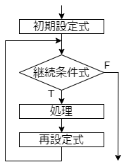
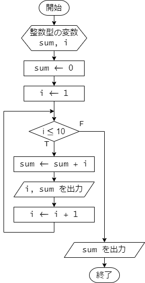
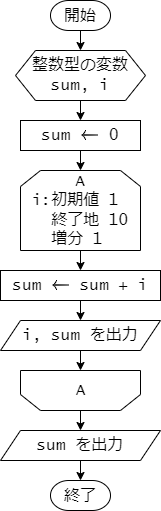
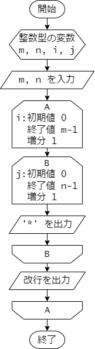
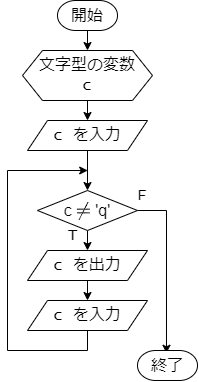
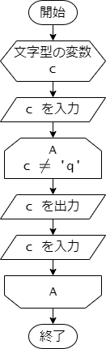
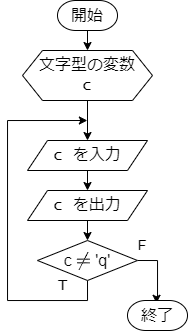
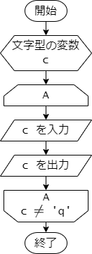

# 第 7 章 : 繰り返し処理

## 7.1 : for 文

### 例題 7-1 : for 文

for 文は、繰り返し処理を行うための文です。
決まった回数の繰り返し処理を行う場合によく利用されます。

次のプログラムは、for 文を利用して 1 から 10 までの整数の和を
途中の計算結果を表示しながら求めるプログラムです。

***`sum.c`***

```c
#include <stdio.h>

int main(void) {
  int sum = 0;
  int i;

  for (i = 1; i <= 10; i++) {
    sum += i;
    printf("i = %d, sum = %d\n", i, sum);
  }

  printf("sum = %d\n", sum);

  return 0;
}
```

for 文の書式は次の通りです。

```c
for (初期設定式; 継続条件式; 再設定式) {
  処理
}
```

for 文の実行の流れは次のフローチャートの通りです。



まず初めに、初期設定式が実行されます。
次に継続条件式が評価され、真であれば処理と再設定式が実行されます。
その後再び継続条件式が評価されます。
継続条件式が真となるあいだは、処理と再設定式が繰り返し実行されます。
継続条件式が偽となると、for 文の実行を終了します。


例題のプログラム `sum.c` では、
初期設定式、継続条件式、再設定式、処理の部分はそれぞれ次のようになります。

- 初期設定式 : `i = 1`
- 継続条件式 : `i <= 10`
- 再設定式 : `i++`
- 処理 : `sum += i; printf("i = %d, sum = %d\n", i, sum);`

プログラム全体の処理の流れを示したフローチャートは次のようになります。
for 文の初期設定式、継続条件式、再設定式、処理の部分がそれぞれフローチャートの
どこに対応するかを確認してください。



実行結果は次の通りです。

***`terminal (実行結果)`***
```
i = 1, sum = 1
i = 2, sum = 3
i = 3, sum = 6
i = 4, sum = 10
i = 5, sum = 15
i = 6, sum = 21
i = 7, sum = 28
i = 8, sum = 36
i = 9, sum = 45
i = 10, sum = 55
sum = 55
```

なお、このプログラムのフローチャートは、ループ端記号を用いて
次のように表すこともできます。



---

### 例題 7-2 : 二重ループ

for 文の処理の中でさらに for 文を利用することで、
いわゆる二重ループを実現することができます。

次のプログラムは、for文による二重ループを利用して、
正の整数 m, n を入力すると、m 行 n 列の `*` で作られた
長方形を表示するプログラムです。

***`rectangle.c`***

```c
#include <stdio.h>

int main(void) {
  int n, m;
  int i, j;

  scanf("%d %d", &m, &n);

  for (i = 0; i < m; i++) {
    for (j = 0; j < n; j++) {
      printf("*");
    }
    printf("\n");
  }

  return 0;
}
```

プログラムの処理の流れを示したフローチャートは次のようになります。



外側のループ(A) は、`m` 行の長方形を作るためのループです。
内側のループ(B) は、各行ごとに `n` 個の `*` を描画するためのループです。
内側のループ(B) が終了すると、改行を出力して、次の行に移ります。


実行結果は次の通りです。
1行目は `m` と `n` を入力しています。
ここでは `m = 4`, `n = 7` としています。
2 行目以降に、4 行 7 列の長方形が表示されています。

***`terminal (実行結果)`***
```
4 7
*******
*******
*******
*******
```


## 7.2 : while 文

### 例題 7-3 : while 文

while 文は、ある条件が真である間、処理を繰り返し行うときに利用します。

次のプログラムは、while 文を利用して、キーボードから `q` が入力されるまで、
入力された文字を表示するプログラムです。

***`echo.c`***
```c
#include <stdio.h>

int main(void) {
  char c;

  scanf(" %c", &c); // " %c" スペースを入れると、空白文字を読み飛ばすことができる

  while (c != 'q') {
    printf("input character : %c\n", c);
    scanf(" %c", &c);
  }

  return 0;
}
```

while 文の書式は次の通りです。

```c
while (継続条件式) {
  処理
}
```

while 文では、はじめに継続条件式が評価されます。
継続条件式が真であれば処理が実行されます。
その後再び継続条件式が評価されます。
継続条件式が偽となると、while 文の実行を終了します。

例題のプログラム `echo.c` の継続条件式は `c != 'q'` です。
ですので、char 型の変数 `c` が `'q'` でない限り、処理が繰り返し実行されます。

プログラム全体の処理の流れを示したフローチャートは次のようになります。



このフローチャートは、ループ端記号を用いて次のようにも表すことができます。



プログラムの実行例を示します。
1, 3, 5 行目は、キーボードからの入力を示しています。
`a` や `3` が入力されたときは、while 文の処理が実行され、
`input character : a` や `input character : 3` が表示されています。
`q` が入力されると、while 文の処理が実行されず、プログラムが終了します。

***`terminal (実行結果1)`***
```
a
input character : a
3
input character : 3
q
```

別の実行例を示します。
1 行目は、キーボードからの入力を示しています。
はじめに `q` が入力されると、while 文の処理が実行されず、プログラムが終了します。

***`terminal (実行結果2)`***
```
q
```

---

## 7.3 : do-while 文

### 例題 7-4 : do-while 文

do-while 文は while 文と同様に、ある条件が真である間、処理を繰り返し行うときに利用します。
ただし、while 文とは処理の流れが若干異なります。

次のプログラムは、do-while 文を利用して、キーボードから `q` が入力されるまで、
入力された文字を表示するプログラムです。

***`echo_do_while.c`***
```c
#include <stdio.h>

int main(void) {
  char c;

  do {
    scanf(" %c", &c);
    printf("input character : %c\n", c);
  } while (c != 'q');

  return 0;
}
```

do-while 文の書式は次の通りです。

```c
do {
  処理
} while (継続条件式);
```

while 文と異なる点は、はじめに処理が実行され、その後継続条件式が評価される点です。
継続条件式が真であれば処理が再び実行されます。
継続条件式が偽となると、do-while 文の実行を終了します。

例題のプログラム `echo_do_while.c` の継続条件式は `c != 'q'` です。

プログラム全体の処理の流れを示したフローチャートは次のようになります。



ループ端記号を用いて次のようにも表すことができます。




プログラムの実行例を示します。
1, 3, 5 行目は、キーボードからの入力を示しています。
`a` や `3` が入力されたときは、繰り返しの処理が実行され、
`input character : a` や `input character : 3` が表示されています。
`q` が入力された場合でも、繰り返しの処理が実行され
`input character : q` が表示されますが、
その後は継続条件式が偽となり、プログラムが終了します。

***`terminal (実行結果1)`***
```
a
input character : a
3
input character : 3
q
input character : q
```

別の実行例を示します。
1 行目は、キーボードからの入力を示しています。
はじめに `q` を入力した場合でも、do-while 文の処理が実行され、
`input character : q` が表示されます。
もちろん、その後は継続条件式が偽となり、プログラムが終了します。

***`terminal (実行結果2)`***
```
q
input character : q
```

---


## 演習

### 演習 7-1

正の整数値 n を入力すると、以下の実行例のように、
高さ n 幅 n の直角三角形の領域を文字 `*` で描画するプログラムを作成してください。

実行例を示します。
1 行目は、ユーザーからの n の値の入力を示しています。

***`terminal (実行結果)`***
```
6
*
**
***
****
*****
******
```


